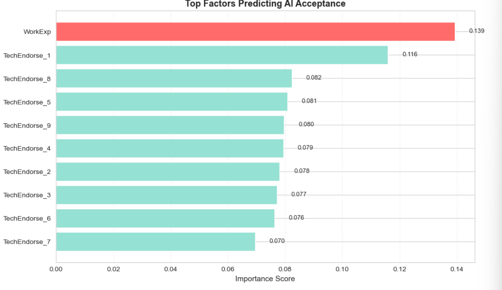
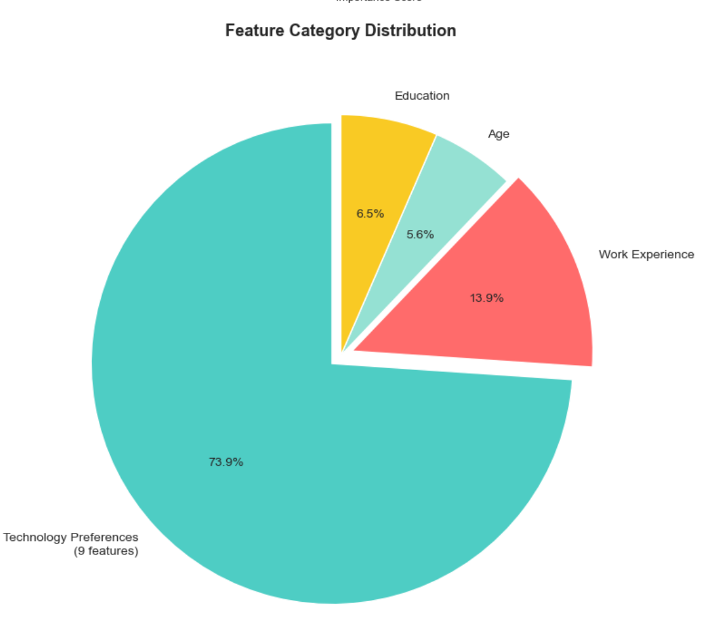
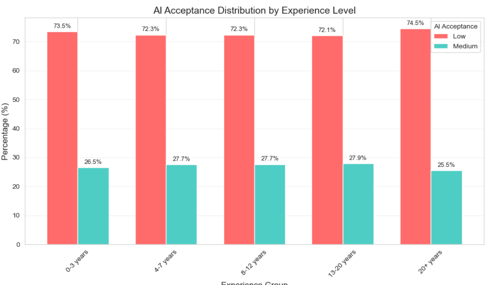
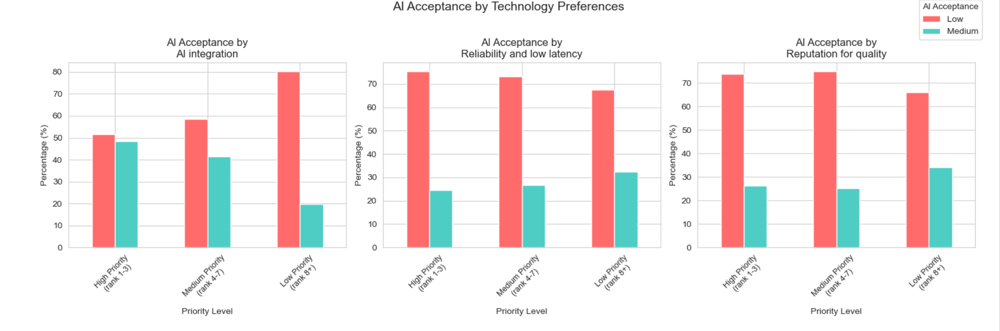

# README

This document serves both as **repository documentation** and a **concise write-up** of the analysis (suitable for a portfolio or blog intro). Setup, data zip, and the file tree are in **Repository & how to run** at the end.

## Overview

This project analyzes survey data from nearly 50,000 developers worldwide to understand how and why developers accept or resist AI tools in their work.  
The goal is to help companies that build AI developer tools create smarter, more user-friendly products.

We focused on three main questions:

1. **What factors best predict AI acceptance?**
2. **How does work experience affect AI acceptance?**
3. **How does AI acceptance differ by technology preferences?**

---

## ✅ Success criteria

Build a machine learning model to predict developers' AI acceptance level (Low/Medium), identify key influencing factors through feature importance analysis, and provide data-driven insights for companies developing AI developer tools.

**What we delivered:**
- Classification model with feature importance ranking
- Identification of top predictors (AI integration = #1)
- Actionable business insights for each finding

One-line summary of answers to the three questions is in **Final takeaways** (below).

---

## 📊 The data & method

**Source**: Stack Overflow Developer Survey 2025 — 49,191 developers worldwide.

**Pipeline (full detail in the notebook)**: Responses are cleaned and restricted to rows with complete AI-related fields; an **AI acceptance** label (Low / Medium) is derived from multiple survey items; features include tech-endorsement scores, work experience, age, and education encoding. A **Random Forest** classifier is trained with a train/test split and **hyperparameter tuning** (grid search). Charts and metrics in this README come from `StackOverFlow_Survey_Analysis(ver.2).ipynb` (recommended); an earlier exploration lives in `StackOverFlow_Survey_Analysis.ipynb`.

---

## 1️⃣ What factors best predict AI acceptance?

**Answer: Developers who prioritize AI features are the most likely to accept AI tools.**





| Top Predictor | Impact |
|---------------|--------|
| AI integration priority | Strongest signal (13.9%) |
| Work experience | Weaker than tech preferences |
| Other tech preferences | 9 features combined = 73.9% of predictions |

> **Key insight**: What developers want predicts acceptance more than who they are.

---

## 2️⃣ How does work experience affect AI acceptance?

**Answer: Surprisingly, experience barely matters.**



| Experience | Medium Acceptance |
|------------|-------------------|
| 0-3 years | 26.5% |
| 4-7 years | 27.7% |
| 8-12 years | 27.7% |
| 13-20 years | 27.9% |
| 20+ years | 25.5% |

> **Key insight**: Gap between highest and lowest is only **2.4%**. Juniors and veterans accept AI at almost the same rate.

---

## 3️⃣ How does AI acceptance differ by technology preferences?

**Answer: A huge gap — 28.6% difference.**



| Priority | AI integration | Reliability | Quality |
|----------|---------------|-------------|---------|
| High | **48.3%** | 24.5% | 26.3% |
| Low | 19.7% | 32.4% | 34.0% |
| Gap | **+28.6%** | -7.9% | -7.7% |

> **Key insight**: AI-feature lovers accept AI. Reliability-focused developers? They're skeptical.

---

## 🎓 Final takeaways

| Question | Answer |
|----------|--------|
| Best predictor of AI acceptance? | **AI integration priority** |
| Does experience matter? | **No** — all levels similar (25–28%) |
| Do tech preferences matter? | **Yes** — 48% vs 20% acceptance |

> **Bottom line**: AI acceptance is driven by **what developers value** — not how long they've coded.

---

## 📁 Repository & how to run

Place the Stack Overflow survey archive in the project root (same folder as the notebooks). The notebook reads CSVs from inside the zip; you do **not** need to extract them manually unless you prefer to.

```
Machine_Learning_FinalProject/
├── StackOverFlow_Survey_Analysis(ver.2).ipynb   # Current analysis & modeling (recommended)
├── StackOverFlow_Survey_Analysis.ipynb          # Earlier notebook version
├── README.md
├── requirements.txt                             # Python dependencies (install with pip)
├── images/                                      # Exported charts for this README
└── stack-overflow-developer-survey-2025.zip     # Survey data (required). Contents include:
    ├── survey_results_public.csv
    ├── survey_results_schema.csv
    └── 2025_Developer_Survey_Tool.pdf
```

Download the official **Stack Overflow Developer Survey 2025** package, rename or ensure the zip is named `stack-overflow-developer-survey-2025.zip`, and put it next to the notebook before running the data-loading cells.

Install Python dependencies: `pip install -r requirements.txt`

---

## Limitations

- **Class imbalance**: The Medium acceptance group is smaller than Low; overall accuracy alone does not fully describe performance on the minority class—see the notebook for classification report and confusion matrix.
- **Association, not causation**: Survey relationships describe patterns in self-reported data, not proof that changing one factor changes acceptance.
- **Generalization**: Results reflect 2025 Stack Overflow respondents and may not extend to all developer populations.

---

## 🙏 Acknowledgments

- **Data**: [Stack Overflow Annual Developer Survey 2025](https://insights.stackoverflow.com/survey)
- **Tools**: pandas, numpy, matplotlib, seaborn, scikit-learn
